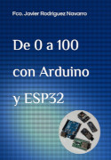

# "De 0 a 100 con Arduino y ESP32"  

Fuentes, esquemas y extras de Libro, que cubre desde la programación básica a la avanzada de estas dos plataformas.

  Descripción y compra: <https://amzn.eu/d/32OJJdF>
   
[Anexo del libro: Fe de erratas, actualizaciones de librerias y nuevos temas](Anexo_Arduino_ESP32.pdf)**  
Resumen: Nuevo ejemplo, actualizaciones tablas WIFI

__Enlaces.txt__ 
Este fichero contiene enlaces de interés para Arduino y ESP: Drivers, placas, componentes.  

**/P_Basica** Ejercicios resueltos de los capítulos iniciales de programación.  

**/ES_Digitales** Este directorio contiene los ejemplos de Entradas y Salidas Digitales.  

- **ES_Digitales**: Ejemplo simple con un botón para ir conmutando los LEDs conectados a la salidas digitales del Arduino.  
- **Ej_DosLeds**: Ejemplo de codificación para ambas plataformas, con funciones de preprocesador.  
- **Ej_INT**: Ejemplo de Interrupciones en entradas digitales de Arduino (apartado dellibro 7.1.4) y ejemplo tambien en Rust "intexternas.rs"  
  
**/E_Analogicas** Este directorio contiene los ejemplos de Entradas analógica  

- **SensorTMP36**: Ejemplo de entrada analógica con un sensor de temperatura TMP36.  
- **TMP36_Display**: Ejemplo anterior usando un display que se conecta por I2C.  

**/PWM**  Este directorio contiene los ejemplos de uso de PWM  
  
- **EyS_Analog**: Ejemplo que utiliza tres entradas analógicas para regular tres salidas PWM que regulan un LED RGB. También se utiliza una entrada digital, con un botón para pasar los datos de los datos de las entradas analógica a sus correspondientes salidas PWM.  
- **Sonido**: Ejemplo de generación de notas con las instrucciones que tone y ledcWriteTone, para Arduino y ESP32 respectivamente.  
- **Música**: Ejemplo interpretación de partituras, y función de unificación para ambos sistemas  
  
[**/Motores**](Motores) Este directorio contiene los ejemplos del uso de los motores: continua, servomotor y Paso a Paso  

**/Comunicaciones**  Este directorio contiene los ejemplos de comunicaciones: Serie, I2C, WIFI, Bluetooth, etc.  
  
- **/EjSerie**: Ejemplo de comunicación de un Arduino y un ESP32 por el puerto Serie, estan los dos programas.
    - "**Ej_SerieArduino**" Espera a recibir información ('P'= por el puerto serie para cambiar de color el LED. En este ejemplo podemos ver también el uso de PWM para el uso de LED RGBs. 
    - "**Ej_SerieESP32**" Espera que se pulse TOUCH para enviar una 'P' al arduino para que cambie el color del LED.  
  
- **/EjI2C**: Ejemplo de comunicación de un Arduino y un ESP32 mediante I2C. 
    - "**Ej_I2CArduino**" Espera a que se pulse un boton para solicitar medida a ESP32, cuando llega se dibuja en el Display y se informa al ESP32. 
    - "**Ej_I2CESP32**" Espera peticion del Arduino y espera que se le informe para cambiar color de LED.  
    - **ScanESP32**: Programa Scan I2C para el ESP32, usando TwoWire y configurando los pines.  
  
- **/BLuetooth**: Ejemplos tratamiento Bluetooth.  
    - **ConfigurarHc05**: Nos permite configurar el modulo HC-05 mediante comandos AT. 
    - **BLEscanESP32**: Localiza dispositivos bluettoth-BLE al alcance. 
    - **/BLE**: Ejemplo de comunicación de un Arduino y un ESP32 mediante I2C.  
        - **BLEservidorESP32**: Servidor con dos servicios y uno con características de L/E y notificación. 
        - **BLEclienteESP32**: Cliente que puede obtener datos de dos servidores BLEservidorESP32.  
  
- **/WIFI**: Ejemplos WIFI. 
    - **WIFI_AP** Ejemplo conexión como punto de acceso con un ESP32. 
    - **WIFI_Scan** Programa que realiza un escaneo de la red WIFI. 
    - **WIFI_HTTP** Ejemplo de realizar una solicitud GET y una solicitud POST con formato JSON. 
    - **WIFIServidorWEB** Ejemplo de un servidor WEB en nuestro ESP32 que nos permitirá encender o apagar un LED y ademas informara del estado de este y el valor de un potenciómetro que simulara ser un sensor de temperatura. 
    - **/WIFI_A_BBDD** Ejemplo de un servidor en python que recibe datos de un cliente ESP32 y los almacena en una BBDD. 
        - **Servidor** Cliente Python que almacena los datos recibidos en una BBDD sqlite3 o en un fichero .CSV. 
        - **Cliente** ESP32 que toma medidas y las envía a un servidor, en nuestro caso realizado en Python.  
  
**/Almacenamiento** Este directorio contiene los ejemplos de almacenamiento de datos en dispositivos permanentes como puede ser una EEPROM.  
  
- **GrabaEEPROM y LeeEEPROM**: Dos simples programas para ver como se graba y leen datos de la EEPROM  
- **GrabaDatos**: Un programa algo más completo de grabación de varios datos (configuraciones WIFI, etc) con sus funciones de escritura y lectura, para grabar datos comunes de configuración. Ejecutamos una vez el programa con nuestros datos de WIFI por ejemplo y luego solo tendremos que copiar la funcion lectura en nuestros programas de WIFI para disponer de los datos de nuestra red.  
- **GPreferencias y L_Preferencias**: Ejemplo de uso para grabar datos con librería Preference.h con dos espacios de nombre, para datos de WIFI y Varios.  
- **Particiones**: Visualizamos las particiones de nuestro dispositivo.  
- **NVS**: Como subir archivos desde la linea de comandos a la partición NVS, que es la que contiene los datos de Preference.h, explicado en el Anexo (3.1.1)  
- **EjSPIFFS**: Ejemplo de uso del sistema de archivos SPIFFS, tanto en subida de datos desde comandos como el uso de varias particiones SPIFFS.  
- **EjSPIFFS_ST7735**: Ejemplo de uso del sistema de archivos SPIFFS, leyendo un fichero de texto y dibujos BMP que se visualizan en la pantalla, usando la librería SPIFFS_ImageReader.  
  
**RFID** Ejemplos para programar RFID/NFC  
  
- **[Ejemplos RFID-NFC ](https://github.com/pinguytaz/RFID-NFC/tree/main/ArduinoRC522)**  Sencillos ejemplos con lector RC522.  
    - **Id_Lector** Valida la comunicación y versión con el lector  
    - **LecturaTarjetas** Lee tarjetas e identintifica el tipo.  
  

**/Varios** Este directorio contiene los ejemplos algo mas complejos, como uso display, motores, generar musica.  
  
- **EjTouch**: Ejemplo simple del uso del las entradas capacitivas del ESP32. 
- **InfoESP32**: Nos da información del ISP32, ID, MAC.. 
- **Multitarea**: Esquema básico para utilizar los dos núcleos del ESP32. 
- **/Modos** Este directorio contiene ejemplos de modo de funcionamiento del ESP32 
    - **LigthSleep**: Ejemplo de sueño ligero que se activa por tiempo. 
    - **DeepSleep**: Ejemplo de sueño profundo con activación por tiempo, TOUCH, GPIO 
- **EjWS2812B**: Ejemplo de uso de los leds RGB WS2812. 
- **EJHCSR04**: Ejemplo de utilización del sensor HC-SR04 para medir distancias a obtaculos.
- **TFTST7735S**: Ejemplo de uso de la pantalla TFT (ST7735) 
  

**/RustArduino**  Ejemplos de como programar Arduino con el lenguaje Rust  
  
- **digitales.rs**:  Ejemplo de uso de pines digitales  
- **motor.rs** Ejemplo digitales usando una salida a un motor de continua.  
- **analogicos.rs**: Ejemplo de uso de entradas analógicas  
- **pwm.rs** Ejemplo de uso de pines PWN, usando Timers realizando un fade de los LEDs.  
- **intexternas.rs** Ejemplo de uso de interrupciones externas.  
- **scani2c.rs** Escanea las direcciones I2C que se encuentran en el BUS.  
- **servomotor.rs** Ejemplo de uso de Timer para el manejo de servomotores.  
- **sonar.rc**  Ejemplo de Timer para utilización del sonar HC-SR04.  
  
  
__Libro: ["De 0 a 100 con Arduino y ESP32"](https://amzn.eu/d/32OJJdF)__  
__Website__: <https://www.pinguytaz.net>  

